# Database Schema — EazyCapture AI Agent

A modular monolith on PostgreSQL with **two-level multi-tenancy:**

- A **`firm`** is the top-level workspace — one per signup. It owns its users
  and its connected Xero orgs; a firm never sees another firm's data.
- Within a firm, **every tenant-scoped table carries `company_id`** (indexed)
  and every query filters on it — one `company` = one Xero org.

The DB holds four kinds of data:

1. **Firm + identity** — the workspace (`firm`) and its users (`app_user`).
2. **Connection state** — which Xero orgs are connected (`company`).
3. **A mirror of Xero** — invoices, bills, contacts, accounts, etc. synced
   locally so audits read from the DB instead of hitting Xero every time
   (`xero_document` + `xero_sync_state`). Xero stays the source of truth; this
   is a kept-fresh cache.
4. **Audit output + review** — the issues each audit found, run history, and
   the accountant's notes / uploaded evidence.

---

## Relationship map (ASCII)

```
                         ┌─────────────┐
                         │    firm     │  workspace / top-level tenant (one per signup)
                         └──┬───────┬──┘  owns every company + user below it (firm_id FK)
            firm_id  ┌──────┘       └──────┐  firm_id
                     ▼                     ▼
              ┌─────────────┐       ┌─────────────┐
              │   company   │       │  app_user   │  users (RBAC)
              │ one Xero org│       └──────┬──────┘
              └──────┬──────┘              │ user_company_access (N:N: who sees which org)
   ┌───────────┬─────┼─────┬───────────┐  ├─────────────────┐
   ▼           ▼     ▼     ▼           ▼  ▼                 ▼
xero_sync_  xero_   health_ audit_  bank_note/      notification_log (email)
state       document check_  batch   bank_document
(watermark) (mirror) result

 invoice → invoice_line_item   ← seed/demo only (live audit uses xero_document)
```

Everything is scoped first by `firm_id`, then by `company_id`. The five tables
hanging off `company` that matter for the live audit: `xero_sync_state` +
`xero_document` (the Xero mirror), `health_check_result` + `audit_batch` (audit
output), and `bank_note`/`bank_document` (review). The `invoice` tables are
seed-only.

---

## 0. Firm isolation (the workspace model)

Each signup creates a **`firm`** — an isolated workspace — with the signing-up
user as its admin. Everything else hangs off it:

- `app_user.firm_id` — every user belongs to one firm.
- `company.firm_id` — every connected Xero org belongs to one firm.

A firm's admin sees only their firm's orgs and team; a user in Firm A can never
read Firm B's data. Isolation is enforced at two choke points:

- **`get_current_company_id`** (single-org routes) — a company in another firm
  returns **404** (never even confirmed to exist).
- **`allowed_company_ids_for`** (cross-org / panorama views) — returns only the
  caller's firm companies.

`company_id` scoping is the second layer: even within a firm, a "selected"-mode
team member only sees the orgs an admin assigned to them.

> The script-created **super-admin** (`scripts/create_admin`) has no firm and is
> the platform operator — it can reach every firm (support / debugging).

---

## 1. The connection model (how a Xero org maps to a `company`)

```
ONE accountant's OAuth grant ─────────────▶ ONE nango_connection_id
                                                   │  (covers many orgs)
                          ┌────────────────────────┼────────────────────────┐
                          ▼                         ▼                        ▼
                   company (Org A)           company (Org B)          company (Org C)
                   tenant_id = t-A           tenant_id = t-B          tenant_id = t-C
```

- A **`company` row = one Xero organisation.**
- **`nango_connection_id`** = one OAuth grant (one accountant's connection).
  A single connection can reach **many** Xero orgs.
- **`xero_tenant_id`** = the specific org *within* that connection.
- **Natural key = (`nango_connection_id`, `xero_tenant_id`)** — NOT tenant
  alone, because two different accountants can each connect the same client org
  under their own connection.
- We **never store Xero access/refresh tokens** — Nango holds and auto-refreshes
  them. We only keep the `connection_id` + `tenant_id` to address API calls.

---

## 2. Xero OAuth + onboarding flow

```
Frontend                Backend (FastAPI)              Nango cloud            Xero
   │  POST /connect-session/   │                           │                   │
   ├──────────────────────────▶│  mint session token       │                   │
   │                           ├──────────────────────────▶│                   │
   │◀── session token ─────────┤                           │                   │
   │                                                        │                   │
   │  open Nango Connect UI ───────────────────────────────▶  user logs in ───▶│
   │                                                        │  grants access    │
   │                                                        │◀── tokens stored ─┤
   │                                                        │                   │
   │           auth.creation webhook  ──────────────────────┤                   │
   │                            │◀── POST /webhooks/nango ───┘                   │
   │                            │  _handle_auth_creation:                        │
   │                            │   • list every org on the connection           │
   │                            │   • create one `company` per org + link user   │
   │                            │   • kick off initial sync + first audit         │
```

- The Nango `end_user.id` is the **logged-in user's UUID**, so every org they
  bring in is linked to their account (`user_company_access`).
- **Webhook-free fallback:** if the webhook can't reach the backend (e.g. local
  dev), the frontend calls `POST /api/v1/integrations/nango/sync-connections/`
  which does the same thing via the live connection. Idempotent (upserts).

---

## 3. DB-backed sync (the Xero mirror)

Rather than re-fetching the whole ledger on every audit, Xero is mirrored into
the DB and kept fresh incrementally.

```
                 ┌──────────────────┐         ┌─────────────────────────────┐
   Xero ──sync──▶│ xero_sync_state  │         │       xero_document         │
                 │ (watermark per   │         │ raw Xero JSON, one row per  │
                 │  company+entity) │         │ (company, entity, xero_id)  │
                 └──────────────────┘         └─────────────────────────────┘
                          │                                  │
                          │  audit reads (AUDIT_SOURCE=db)    │
                          └──────────────┬───────────────────┘
                                         ▼
                                reshape → run checks → health_check_result
```

- **`xero_sync_state`** — one row per `(company, entity)`. Holds the
  **watermark** (the latest `UpdatedDateUTC` synced). The next sync asks Xero
  only for records changed since then (`If-Modified-Since`).
- **`xero_document`** — the mirrored data. One row per `(company, entity,
  xero_id)`, storing the **raw Xero JSON** verbatim, so the audit reshapes it
  exactly as it would a live payload (the check logic is identical regardless of
  source).
- **Entities synced:** `invoice`, `bank_transaction`, `credit_note`, `contact`,
  `account` (incrementally, via watermark) and `tax_rate`, `payment`,
  `organisation` (small / full-refresh).

---

## 4. ER diagram (Mermaid)

> Renders in GitHub/GitLab/Notion. No GitHub? See **"How to view"** at the bottom.

```mermaid
erDiagram
    firm ||--o{ company : "owns"
    firm ||--o{ app_user : "owns"
    company ||--o{ xero_sync_state : "sync state"
    company ||--o{ xero_document : "mirrored Xero data"
    company ||--o{ health_check_result : "audit findings"
    company ||--o{ audit_batch : "audit runs"
    company ||--o{ bank_note : "review notes"
    company ||--o{ bank_document : "uploaded files"
    company ||--o{ invoice : "seed data"
    company ||--o{ user_company_access : "scoped to"
    invoice ||--o{ invoice_line_item : has
    app_user ||--o{ user_company_access : "assigned"
    app_user ||--o{ notification_log : "sent to"

    firm {
        uuid id PK
        text name "workspace name"
        timestamptz created_at
    }

    company {
        uuid id PK
        uuid firm_id FK "owning workspace"
        text name
        text xero_tenant_id "the Xero org"
        text nango_connection_id "the OAuth grant"
        text xero_shortcode "deep-link code"
        boolean is_active
        jsonb audit_config "disabled rules, excludes, marked-ok…"
        timestamptz created_at
    }

    xero_sync_state {
        uuid id PK
        uuid company_id FK
        varchar entity "invoice | contact | …"
        timestamptz watermark_utc "max UpdatedDateUTC synced"
        timestamptz last_sync_at
        varchar last_status
        int last_record_count
    }

    xero_document {
        uuid id PK
        uuid company_id FK
        varchar entity
        varchar xero_id "InvoiceID / ContactID / …"
        jsonb raw_json "raw Xero object"
        timestamptz updated_date_utc
        timestamptz synced_at
    }

    health_check_result {
        uuid id PK
        uuid company_id FK
        uuid document_id
        varchar document_type
        varchar kind
        varchar status "blocked | passed | …"
        jsonb result "rule_ids, flagged, AI details"
        timestamptz ran_at
    }

    audit_batch {
        uuid id PK
        uuid company_id FK
        varchar status
        int total
        int trapped
        int contacts_total
        jsonb audit_summary
        timestamptz started_at
        timestamptz completed_at
    }

    bank_note {
        uuid id PK
        uuid company_id FK
        varchar account_code
        varchar period_end
        uuid author_user_id
        text body
        jsonb tagged_user_ids
        timestamptz created_at
    }

    bank_document {
        uuid id PK
        uuid company_id FK
        varchar account_code
        varchar period_end
        text filename
        varchar content_type
        int size_bytes
        bytea content "the file bytes"
        timestamptz created_at
    }

    app_user {
        uuid id PK
        uuid firm_id FK "owning workspace"
        text email
        varchar role "admin | team_member"
        varchar company_access_mode "all | selected"
        text nango_connection_id
        timestamptz created_at
    }

    user_company_access {
        uuid id PK
        uuid user_id FK
        uuid company_id FK
    }

    notification_log {
        uuid id PK
        uuid user_id FK
        text recipient_email
        varchar kind
        varchar status
        timestamptz created_at
    }

    invoice {
        uuid id PK
        uuid company_id FK
        text vendor_name
        numeric amount
        varchar status
        varchar type
    }

    invoice_line_item {
        uuid id PK
        uuid invoice_id FK
        numeric line_amount
        varchar account_code
    }
```



---

## 5. Tables by purpose

### Firm / workspace (top-level tenant)
| Table | Purpose |
|---|---|
| `firm` | one workspace, created per signup. Owns its users (`app_user.firm_id`) and connected orgs (`company.firm_id`). The isolation boundary — a firm never sees another firm's data. |

### Tenant + connection
| Table | Purpose |
|---|---|
| `company` | one connected Xero org, owned by a `firm` (`firm_id`). Natural key `(nango_connection_id, xero_tenant_id)`. `audit_config` (JSONB) holds per-org settings — disabled rules, bank-account excludes, marked-ok, manual statement balances. |

### Xero mirror (DB-backed sync)
| Table | Purpose |
|---|---|
| `xero_sync_state` | per-`(company, entity)` watermark + last-run metadata. Drives incremental sync. |
| `xero_document` | the mirrored Xero records — raw JSON, one row per `(company, entity, xero_id)`. The audit reads from here. |

### Audit output + review
| Table | Purpose |
|---|---|
| `health_check_result` | **the audit verdicts** — one row per flagged document (its issues bundled in `result.rule_ids`). |
| `audit_batch` | each audit run's status + counters (total, trapped, contacts_total). |
| `bank_note` | accountant's notes on a bank account at a period end (Bank Balance Check). Internal — never sent to Xero. |
| `bank_document` | supporting files (bank statements, spreadsheets) for a bank account at a period end. Bytes stored in-DB. |

### Identity / RBAC
| Table | Purpose |
|---|---|
| `app_user` | users (admin / team_member), owned by a `firm` (`firm_id`). Holds invite tokens + `company_access_mode`. |
| `user_company_access` | N:N join — which companies each "selected"-mode member can access (within their firm). |

### Notifications
| Table | Purpose |
|---|---|
| `notification_log` | every email send + delivery status. |

### Legacy / seed
| Table | Purpose |
|---|---|
| `invoice`, `invoice_line_item` | seeded demo data (used when an org has no live Xero connection). The live audit uses `xero_document`. |

> The Insights feature adds a few more tables (`client_insight_snapshot`,
> `snap_*`) — pre-computed KPI snapshots, outside the audit path.

---

## 6. Inside `health_check_result` (where the checks land)

One row = one flagged **document**. The columns people confuse:

| Column | Meaning | Example values |
|---|---|---|
| `document_type` | kind of Xero doc | `ACCREC`, `ACCPAY`, `ACCRECCREDIT`, `ACCPAYCREDIT`, `CONTACT` |
| `kind` | **when/where** it was checked (not the issue) | `pre_ledger`, `post_ledger`, `preview` |
| `status` | the verdict | `blocked` (= "trapped"), `passed`, `unavailable`, `skipped` |
| `result` (JSONB) | **the actual issues + AI details** | see below |

The **issue type is not a column** — it lives in `result.rule_ids`:
```json
result = {
  "rule_ids": ["missing_tax", "duplicate_invoice"],   // issue types (array → many per doc)
  "flagged":  [ {"message": "...", "severity": "critical"} ],
  "messages": "Tax code missing — required by Xero. | ...",
  "resolved": false,        // resolution flags live here, not in `status`
  "dismissed": false
}
```

- One document with 2 problems → **1 row**, 2 entries in `result.rule_ids`.
- `resolved` / `dismissed` are **flags inside `result`**, not `status` values.
- Results tie to a run by `company_id` + `ran_at` (there is no `batch_id` FK).

---

## Foreign keys

| From | → To | On delete |
|---|---|---|
| `company.firm_id` | `firm.id` | CASCADE |
| `app_user.firm_id` | `firm.id` | CASCADE |
| `xero_sync_state.company_id` | `company.id` | CASCADE |
| `xero_document.company_id` | `company.id` | CASCADE |
| `health_check_result.company_id` | `company.id` | CASCADE |
| `audit_batch.company_id` | `company.id` | CASCADE |
| `bank_note.company_id` / `bank_document.company_id` | `company.id` | CASCADE |
| `invoice.company_id` | `company.id` | CASCADE |
| `invoice_line_item.invoice_id` | `invoice.id` | CASCADE |
| `user_company_access.{user_id, company_id}` | `app_user.id` / `company.id` | CASCADE |
| `notification_log.user_id` | `app_user.id` | SET NULL |

Deleting a `company` cascades to all its mirrored data, audit history, notes
and uploads. Deleting a `firm` cascades to all its companies and users.

---

## Design notes

- **Two-level multi-tenancy:** `firm` is the workspace boundary (each signup is
  isolated); within a firm every audit/sync table carries `company_id` (indexed),
  and every query filters on it. Both layers are enforced by tests.
- **Xero is the source of truth; the DB is a kept-fresh mirror** — `xero_document`
  is refreshed incrementally and can always be rebuilt from Xero.
- **Each module owns its own model file**; tables link by name (no cross-module
  Python imports).
- Migrations live in `alembic/versions/` and build the schema incrementally.

---

## How to view the Mermaid diagram (no GitHub needed)
1. **mermaid.live** — paste the ```mermaid``` block above → renders instantly.
2. **VS Code** — install "Markdown Preview Mermaid Support", open this file, Preview.
3. **Notion** — paste into a `/code` block set to "Mermaid".
