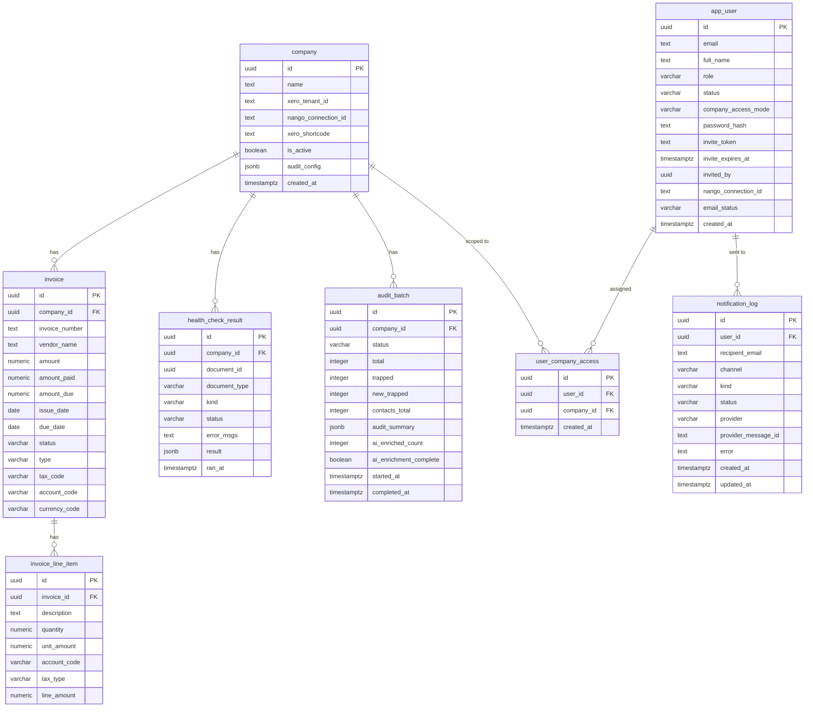

# Database Schema — EazyCapture AI Agent

A modular monolith. **8 tables across 3 modules.** Multi-tenant: every
audit-domain table carries `company_id`. We store **audit findings + history**,
not a copy of Xero's data — Xero stays the source of truth.

---

## Relationship map (ASCII)

```
                          ┌─────────────┐
                          │   company   │  ← the tenant (a Xero org)
                          └──────┬──────┘
        ┌──────────────┬────────┼─────────────┬───────────────────┐
        │              │        │             │                   │
   ┌────▼────┐  ┌──────▼──────┐ │      ┌──────▼──────┐   ┌─────────▼──────────┐
   │ invoice │  │health_check │ │      │ audit_batch │   │ user_company_access│
   └────┬────┘  │   _result   │ │      └─────────────┘   └─────────┬──────────┘
        │       └─────────────┘ │                                  │ (N:N join)
   ┌────▼──────────────┐        │                          ┌───────▼────────┐
   │ invoice_line_item │        │                          │   app_user     │  ← users (RBAC)
   └───────────────────┘        │                          └───────┬────────┘
                                │                                  │
                                                           ┌───────▼──────────┐
                                                           │ notification_log │  ← email tracking
                                                           └──────────────────┘
```

---

## ER diagram (Mermaid)

> Renders automatically in GitHub/GitLab/Notion. No GitHub? See **"How to view"** at the bottom.



---

## Foreign keys

| From | → To | On delete |
|---|---|---|
| `invoice.company_id` | `company.id` | CASCADE |
| `invoice_line_item.invoice_id` | `invoice.id` | CASCADE |
| `health_check_result.company_id` | `company.id` | CASCADE |
| `audit_batch.company_id` | `company.id` | CASCADE |
| `user_company_access.user_id` | `app_user.id` | CASCADE |
| `user_company_access.company_id` | `company.id` | CASCADE |
| `notification_log.user_id` | `app_user.id` | SET NULL (keep the log if user removed) |

`user_company_access` is the **N:N join** between users and companies (RBAC "selected" mode).

---

## Tables by module

### HEALTHCHECK (audit domain) — `app/modules/healthcheck/models.py`
| Table | Purpose |
|---|---|
| `company` | the tenant (a connected Xero org); natural key = (nango_connection_id, xero_tenant_id) |
| `health_check_result` | **the audit verdicts** — one row per flagged **document** (its issues are bundled in `result.rule_ids`, so a doc with 2 problems is still 1 row) |
| `audit_batch` | each audit run's status + counters (total, trapped, contacts_total) |
| `invoice` / `invoice_line_item` | **seeded/demo data only** — NOT used by the live Xero audit |

### AUTH (identity / RBAC) — `app/modules/auth/models.py`
| Table | Purpose |
|---|---|
| `app_user` | users (admin / team_member), invite tokens, `email_status` |
| `user_company_access` | which companies each team member can access |

### NOTIFICATIONS — `app/modules/notifications/models.py`
| Table | Purpose |
|---|---|
| `notification_log` | every email send + delivery status (sent / delivered / bounced / complained) |

---

## Inside `health_check_result` (the important one)

One row = one flagged **document**. Don't confuse these columns:

| Column | Meaning | Example values |
|---|---|---|
| `document_type` | what kind of Xero doc | `ACCREC`, `ACCPAY`, `ACCRECCREDIT`, `ACCPAYCREDIT`, `CONTACT` |
| `kind` | **when/where** it was checked (NOT the issue) | `pre_ledger`, `post_ledger`, `preview` |
| `status` | the verdict | `blocked` (= "trapped"), `passed`, `unavailable`, `skipped` |
| `result` (JSONB) | **the actual issues + AI details** | see below |

The **issue type** is NOT a column — it lives in `result.rule_ids`:
```json
result = {
  "rule_ids": ["missing_tax", "missing_invoice_number"],   // the issue types (an array → many per doc)
  "flagged":  [ {"message": "...", "severity": "critical"} ],
  "messages": "Tax code missing — required by Xero. | ...",
  "resolved": true,        // resolution flags live here too (not in `status`)
  "dismissed": false
}
```

- One document with 2 problems → **1 row**, 2 entries in `result.rule_ids`.
- `resolved` / `dismissed` are **flags inside `result`**, not `status` values.
- Results tie to a run by `company_id` + `ran_at` (timing) — there is **no `batch_id` FK** to `audit_batch`.

## Design notes
- **Multi-tenant:** every audit-domain table has `company_id` (indexed, NOT NULL); every query filters on it.
- **We store findings + history, NOT Xero's data.** `company`, `health_check_result`, `audit_batch` are the live path. Xero is read live each audit (via Nango proxy) and stays the source of truth.
- **`invoice` / `invoice_line_item`** are leftover seeded-demo tables — not on the live audit path.
- **Decoupled:** each module owns its own model file; FKs link them by table name (no cross-module Python imports).
- **8 migrations** (`alembic/versions/0001`–`0008`) build this incrementally.

---

## How to view the Mermaid diagram (no GitHub needed)
1. **mermaid.live** — open https://mermaid.live, paste the ```mermaid``` block above → renders instantly. No account.
2. **VS Code** — install the "Markdown Preview Mermaid Support" extension, then open this file and hit Preview.
3. **Notion** — paste into a `/code` block set to "Mermaid", or a Mermaid embed.
